I'm Nazan.
I'm a junior high school student who loves anime and programming.

- 📚 I'm currently learning Go and TypeScript
- 📺 I watch anime when I get bored
- ⚡ I'm programming with my phone
- 🐈 I love cattt 🙀

### 🤔 What am I doing?

I don't know what I'm doing.

I use github to store some of the projects I create.
Not all my projects are stored on github.
I kept the project on github because I traumatized deleting a project with `rm -rf` on my termux ☠️

